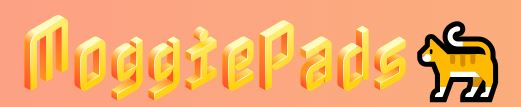

# MoggiePads
### *Mi primer proyecto con React ⚛️*

***

***

[!IMPORTANT] 
> Proyecto desplegado

0 - Introducción
=
***

Tras terminar la unidad de REACT y hacer ejemplos
tutelados en clase, este ha supuesto el primer proyecto para nosotros,
implementando todo lo aprendido (Hooks, Router, Componetización,
eventos etc. )

Mi proyecto, **MoggiePads**, consiste en una
plataforma tipo Pinterest/Tumblr/IG pero enfocada en fotos
de gatos. Podemos registrarnos para ver contenido infinito, usar filtros, añadir/
quitar de favoritos, visitar nuestro perfil y conocer 
algo de información sobre cada raza aparecidas en las fotos.

> Para la creación de _MoggiePads_ he utilizado la API:
> https://thecatapi.com/

Además de los requisitos/objetivos del propio proyecto, 
establecí también algunos propios:

> * Documentación propia: https://www.notion.so/T5-REACT-1-5d2fea2145e6414b859cba3adecb7add?pvs=4
> Antes de empezar el proyecto, con el fin de que me sirviera de guía
> y para mejorar mi entendimiento de lo dado en clase, decidí
> crear una pequeña documentación a modo de introducción a React.
> Esta fue realizada basándome en lo visto en clase, en la documentación oficial
> y en guías de youtube. Visto en 
> retrospectiva ahora terminado el proyecto, esta docu tiene sus fallos y explicaciones a mejorar
> pero como punto de partida me fue de gran utilidad.
>
> * Usar el inglés para el código y también para git
> Dejar atrás la notación snake_case y empezar a usar
> camelCase
> * Evitar comentarios innnecesarios en el código
> * Mejorar mi uso de sintaxis JS (usar ternarias, funciones
> como filter, some, map etc, evitar
> else innecesarios, )

    
1 - Estructura de la web
=
***
> En MoggiePads contamos con las siguientes
> rutas de navegación.

1. **Inicio**: Es la página principal que se 
muestra al entrar en la web. Tiene una foto que al hacer click 
en ella cambiará de foto mediante una llamada a la API.

2. **Entrar / Registrarse**: En esta página nos encontramos
con el formulario para entrar con nuestras credenciales.
A su vez cuenta con un botón que nos redirige a la página de registro.

3. **Mi Perfil**: Es una ruta protegida mediante un LayoutPrivate, que
detectará si el usuario está loggeado. De ser así entrará en su perfil
donde se mostrarán sus favoritos y su información de usuario. 
   

   En caso contrario, será redirigido al inicio.

4. **Fotos**: Sección principal de la web y también ruta protegida. 

* Contiene una galería de imágenes
obtenidas de la API y mostradas en formato *Card*. La paginación está implementada
mediante scroll infinito. 
   
   
   Al hacer hover sobre las cards se despliega
   información sobre la raza del gato de la foto.

   >[!WARNING]
> * **En ese hover no se hace llamada
anidada a la API para mostrar la información
ya que la llamada original me devuelve ya los objetos
con su información asociada, por tanto comentamos
> en clase que no tenía sentido su implementación.**

   * Cuenta con filtros y barra de búsqueda por los
   que se pueden buscar fotos de razas específicas.

   >[!IMPORTANT]
   > * **Debido a limitaciones de la API, cuyo único parámetro por el
   > que se puede filtrar son las razas de gatos, tanto la barra de búsqueda
   > como los filtros hacen las mismas llamadas a la API.**
   
   > * **Estas llamadas tampoco permiten paginación,
   > por tanto al hacer scroll no se cargarán más fotos
   > de las obtenidas en esa primera llamada.**

   * También encontramos un botón con la etiqueta infinito
que nos permitirá volver a la galería infinita y aleatoria.

5. Contacto: Última ruta de nuestra app
la cual contiene un formulario de quejas/sugerencias.

***

2 - Tecnologías usadas
=
***

* **Vite**: Como empaquetador tanto para el desarrollo como el despliegue
* **React-Router-DOM**: Librería que permite configurar 
rutas de forma cómoda y sencilla. Funciona como una especie
de *contexto* con su respectivo *provider*.
* **React-Icons**: Biblioteca para react que permite 
importar iconos como si fueran componentes.
* **Lodash**: Librería para react con
funciones relativas al *throttle*, las cuales permiten
inhabilitar la ejecución de ciertas funciones durante X milisegundos.
En mi caso la he usado de forma muy básica para disminuir el
exceso de llamadas realizadas por mi implementación de scroll infinito.
***

3 -  Usando Hooks de React
=
En mi proyecto he usado los distintos Hooks:

> * **useState**: Para manejar estados locales, que nos permiten
> que react recuerde/actualice valores entre renderizados
> * **useEffect**: Este Hook nos permite ejecutar
> cierta función/código cada vez que se actualiza
> la alguno de los valores
> de la lista de dependencias que tiene asociada.
> Si se pone la lista vacía se ejecutará una vez al
> renderizarse el componente
> * **useContext**: Crea un estado global mediante el cual
> se puede usar/actualizar desde cualquier parte de la app.
> Para usarlo debemos envolver con su provider en el main
> de nuestra aplicación.
> * **useRef**: Nos permite acceder a un elemento del DOM
> como referencia entre renderizados. Lo he usado para hacer focus
> en inputs al cargar la página y para la lógica 
> del scroll infinito.
> * **CustomHooks**: Finalmente he usado un pequeño hook
> para manejar una llamada a la api pero sin token. 
> Este hook ha sido usado en la pequeña funcionalidad 
> de la landpage de hacer click en la foto y generar 
> otra nueva.
> 

***

4 - Mejoras / Dificultades
=

Aunque en general el proyecto creo que ha ido bastante bien 
y siento que he aprendido bastante, creo que
podría mejorar en aplicar una mayor componetización, (searchbar y los filtros
podrían ser componentes aparte), un mejor uso de los estilos
del css y quizá en un uso más eficiente de ciertos hooks.
